<picture>
  <source media="(prefers-color-scheme: dark)" srcset="dark.svg">
  <source media="(prefers-color-scheme: light)" srcset="light.svg">
  
</picture>

 

---

### 👋 About Me

I'm a **Full Stack Developer** and **Programming Educator** based in Chennai, Tamil Nadu. I teach programming at **CSC Computer Education** while continuing to build my own skills as a fresher stepping into full-time development — currently deepening my front-end/back-end fundamentals and exploring **Go**. I care about writing clean, responsive, user-friendly interfaces and about helping students actually understand the "why" behind the code, not just the syntax.

- 🎓 B.Sc. Computer Science, Prince Shri Venkateshwara Arts and Science College (2020–2023)
- 🧑‍🏫 Programming Teacher @ CSC Computer Education (Apr 2023 – present)
- 🎧 Former Customer Support Associate @ Sutherland Global Services (Sep 2023 – May 2025)
- 🏆 Smart India Hackathon participant, 2022 & 2023
- 📜 Certified in J2EE (2022), DAST (2023), and currently completing a Data Analyst certification (Novi Tech, 2025)

---

### 🛠️ Tech Stack

**Languages & Markup**

**Frameworks & Libraries**

**Databases**

**Tools**

**AI Tools**

---

### 🚀 Featured Projects

| Project | Description |
|---|---|
| **Detection of Hacking using Honeycomb** | Analyzes user behavior on social media (posting patterns, timing, IP address, and location) to flag suspicious activity. |
| **Train Ticket Booking** | A site for booking train tickets end-to-end. |
| **E-Commerce Platform** | An Amazon-style storefront for browsing and purchasing items. |

---

### 📊 GitHub Stats

---

### 🌱 Currently

- Building full-stack projects while learning **Go**
- Finishing a **Data Analyst** certification with Novi Tech
- Mentoring students in web development fundamentals
- Open to full-time developer roles

---

### 📫 Connect with Me

Built with 💜 — pure SVG hero banner, no JavaScript, GitHub-native dark/light mode.

